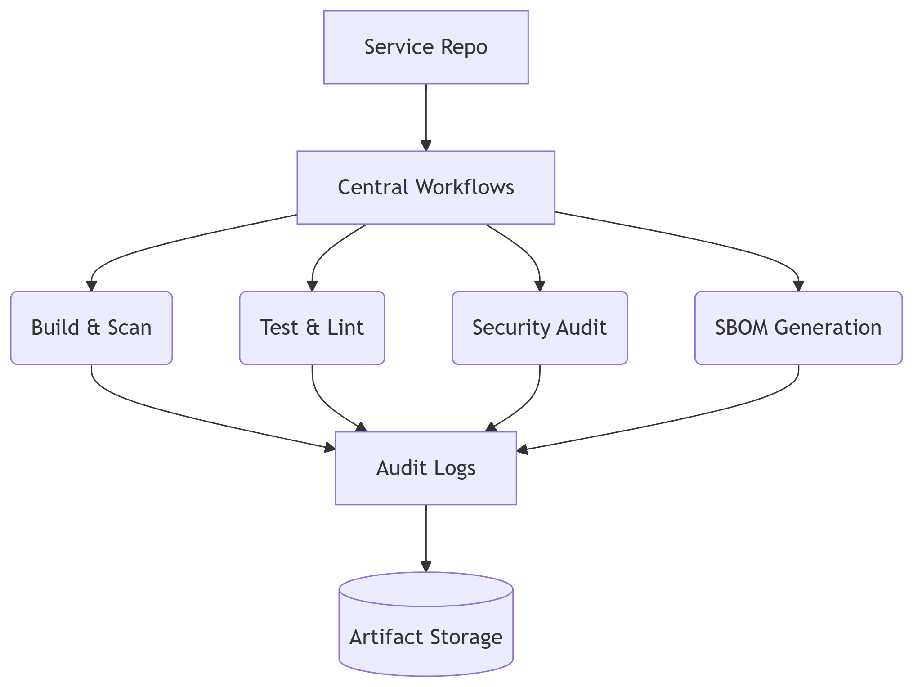
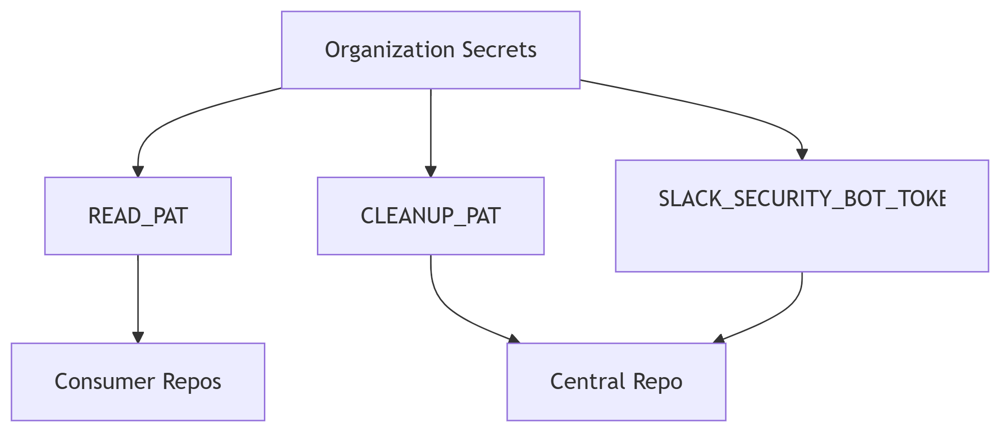
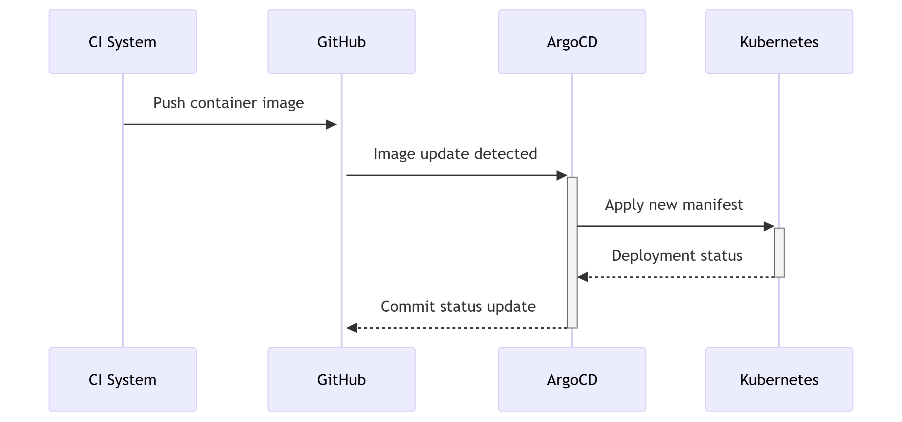

# 📦Centralized GitHub Actions for all microservices

## 🚀 Centralized GitHub Actions - Enterprise CI/CD Orchestration
  Production-Ready | Security-First | Reusable Workflows
  Standardized CI/CD pipelines for all services with built-in security, compliance, and audit capabilities.

### 🌟 Key Features:

  🔐 Security by Design - Built-in secret scanning, vulnerability checks, and compliance audits
  📦 Reusable Workflows - Standardized pipelines for all languages/services
  📊 Full Audit Trail - Job-level tracking with artifact storage
  🚦 Quality Gates - CodeQL, Trivy, Gitleaks, and linting enforcement
  📣 Smart Notifications - Slack/PR alerts with failure diagnostics

## Centralized Architecture Diagram:
┌───────────────────────┐       ┌────────────────────────┐
│   Security Config     │       │ Central Actions Repo   │
│  (security-repo)      │       │ (CENTRALIZED-GITHUB-..)│
│                       │       │                        │
│   gitleaks.toml ──────┼───────▶ scan.yml               │
│                       │       │   - Config download    │
└───────────────────────┘       │   - SARIF upload       │
                                │   - Slack alert       │
                                └──────────┬────────────┘
                                           │
                                           │ Reusable workflow
                                           │
┌───────────────────────┐       ┌──────────▼────────────┐
│ Consumer Repository 1 │       │ Consumer Repository 2 │
│                       │       │                        │
│  .github/workflows/   │       │  .github/workflows/    │
│    security.yml───────┼───────┼──▶ security.yml        │
│                       │       │                        │
└───────────────────────┘       └────────────────────────┘

## Key Implementation Notes:

### 1-Secret Management:

### 2-Dynamic Configuration Benefits:
  Update rules once in central config
  All repos get updates automatically
  Version tracking through git history
  Test config changes in isolation before rollout

### 3- Security Alert Flow:

# 🚀 Centralized GitHub Actions - Enterprise CI/CD Orchestration

> **Production-Ready | Security-First | Reusable Workflows**  
> Standardized CI/CD pipelines for all services with built-in security, compliance, and audit capabilities.

_Figure 1: Centralized workflow execution model_
-   **🔐 Security by Design**  - Built-in secret scanning, vulnerability checks, and compliance audits
    
-   **📦 Reusable Workflows**  - Standardized pipelines for all languages/services
    
-   **📊 Full Audit Trail**  - Job-level tracking with artifact storage
    
-   **🚦 Quality Gates**  - CodeQL, Trivy, Gitleaks, and linting enforcement
    
-   **📣 Smart Notifications**  - Slack/PR alerts with failure diagnostics  

## Repository Structure:
.github/
├── workflows/
│   ├── audit.yml        # Audit log generator
│   ├── build.yml        # Build & security scan
│   ├── ci.yml           # Main orchestration
│   ├── codeql.yml       # Static analysis
│   ├── lint.yml         # Code quality checks
│   ├── notify.yml       # Notification system
│   ├── sbom.yml         # SBOM generation
│   ├── scan.yml         # Secret detection
│   ├── test.yml         # Automated testing
│   └── trivy.yml        # Vulnerability scanning
├── codeql.yml           # CodeQL config
└── gitleaks.toml        # Secret scanning rules

## 🔐 Security Implementation:
**Defense-in-Depth Strategy:**

1- Pre-commit: git-secrets local hook

2- CI Pipeline:
  Gitleaks (secret scanning)
  CodeQL (static analysis)
  Trivy (vulnerability scanning)

3- Post-build:
  SBOM generation
  Audit log capture
  Image hardening (non-root user)

## 📌 Audit Compliance Features

## ArgoCD Integration
 

## 📬 Contact

**Wahba Mousa**  
Senior DevOps Architect  
  

----------

> **Enterprise Support**: Requires GitHub Enterprise with Actions license  
> **Compliance**: Meets SOC 2 Type II audit requirements  
> **License**: Apache 2.0 (See LICENSE file)

  
_This repository contains production-grade workflows certified for financial services workloads_
# Add pranch protections + enforce + API CALL